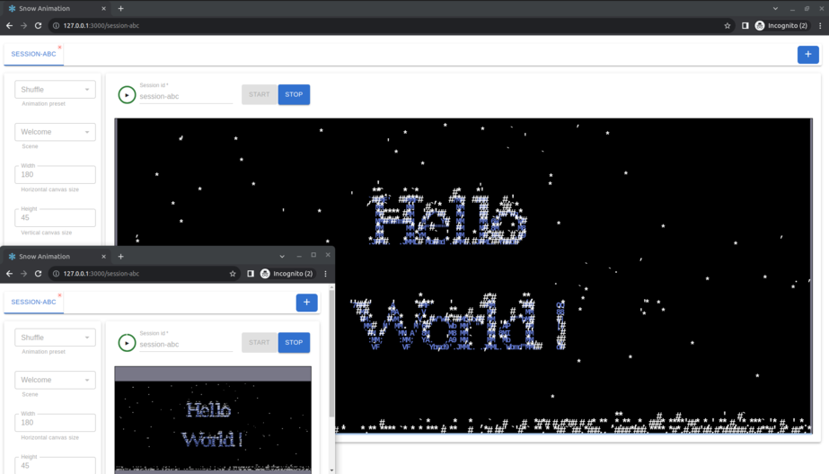
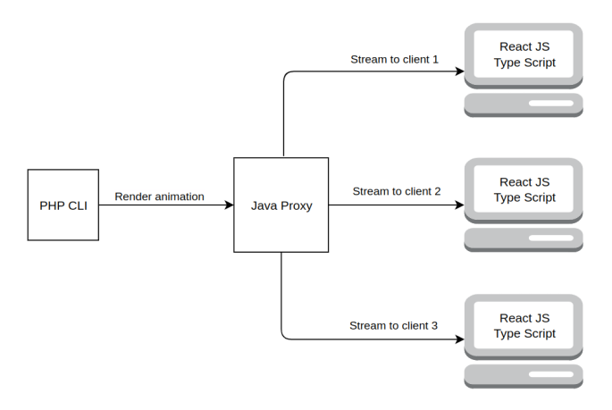

# PHP Snow Live Stream Toy
Continuation of [PHP Terminal Snow Toy](https://github.com/mmmostrowski/php-snow) project.<br>




## How it works ?
The PHP Snow Live Stream Toy works as follows:

1. A single PHP CLI process generates an animation and sends it to a pipe.
2. A Java Proxy Server receives the animation from the pipe and buffers it.
3. Multiple React Webapp Clients live-stream the same animation via Websockets and render it. 




## Quick run
To quickly run the application, follow these steps:

1. Open a terminal and execute the following command to start the Client:
```bash
docker run --name php-java-react-snow-client -it --rm -p3000:3000 mmmostrowski/php-java-react-snow-client
```
Note: Press Ctrl+C to stop the client.
2. Open a second terminal and execute the following command to start the Server:
```bash
docker run --name php-java-react-snow-proxy -it --rm -p8080:8080 mmmostrowski/php-java-react-snow-proxy snow-server
```
Note: Press Ctrl+C to stop the proxy server.
3. Once both the client and the proxy server are running, visit http://localhost:3000/ in your web browser.


## Develop in an IDE
Follow these steps to develop using an IDE:

1. Start the Java Proxy server by running `bootRun` Gradle action in IDE,
2. To run the Web Client, execute the following command in the terminal:
```bash
./dev docker compose up --build reactjs-client 
```
3. To reflect Java Proxy changes, relaunch the `bootRun` Gradle action. <br>
   Changes made to the Web Client will be automatically reflected in the web browser due to React's hot-reloading feature.
   PHP changes will be automatically updated during each animation start. <br>
4. You can launch the PHP CLI by running the following command in the terminal:
```bash
./dev docker compose run java-proxy bash 
```
5. Run tests by executing the test Gradle action. 

To access the application during development, visit http://localhost:8181/ in your web browser.


## Develop without an IDE
To develop without an IDE, follow these steps:

1. Run the following command in the terminal to start the entire application:
```bash
./dev docker compose up --build
```
2. Access the application at http://localhost:8181/ in your web browser.
3. Make changes and repeat the process from step 1 as needed.
4. Run tests by executing the following command in the terminal:
```bash
./dev docker compose run java-proxy test
```


## Cleanup
When you are done, use the following command in the terminal to clean up the environment:
```bash
docker compose down -v
```

<br>
Note: Please ensure that you have Docker installed and set up on your system before running the commands above.
<br>
